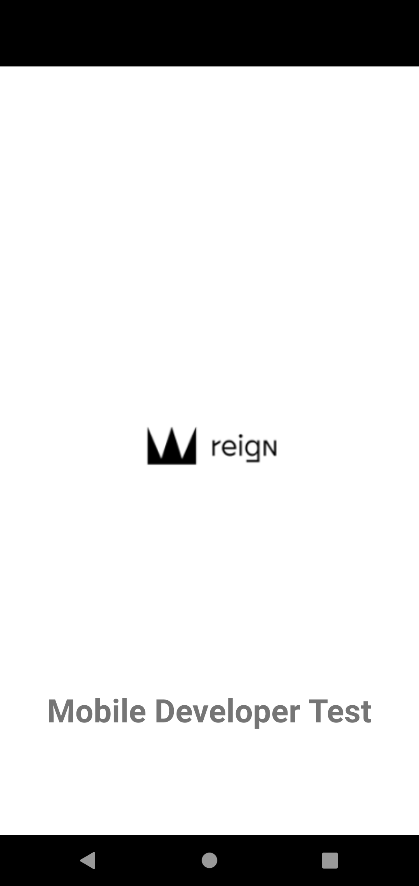
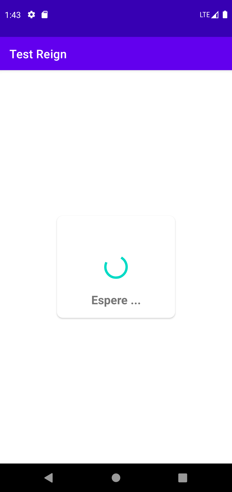
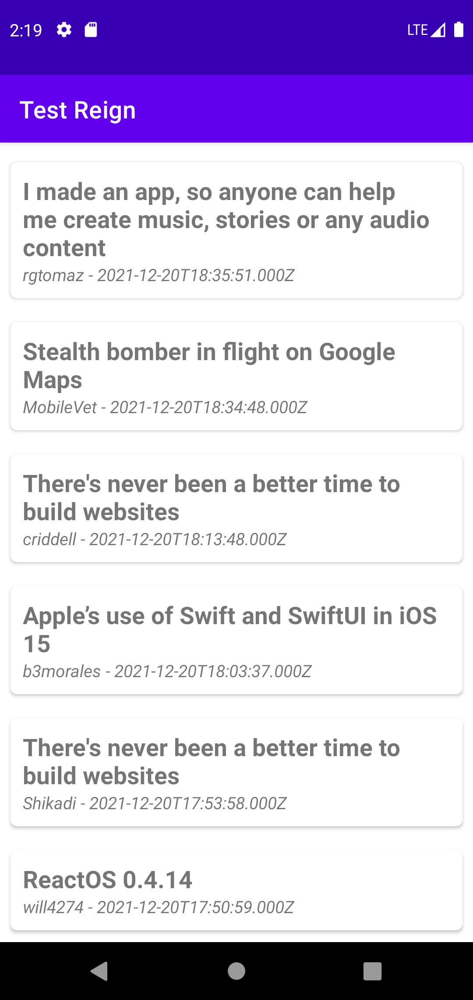
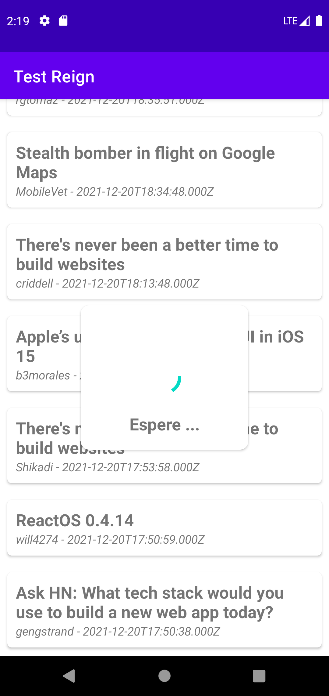
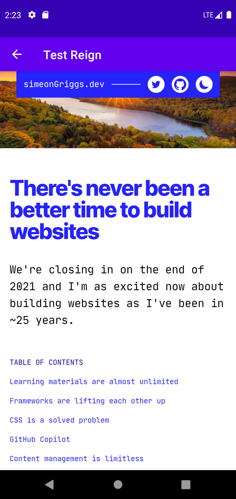

# Test_Reign

We would like you to build a small mobile application to test your knowledge of iOS or Android
technologies. 
You can choose to complete the task using any one of: 
* Kotlin (required) for Android as an Android Studio project 
 
Please refer to the attached wireframe for an understanding of what the finished app should look 
like. 
On startup, and when the listview is pulled down to refresh, the app should connect to this API
which shows recently posted articles about Android or iOS on Hacker News: 
https://hn.algolia.com/api/v1/search_by_date?query=mobile 
If the app is used offline, it should show the items downloaded last time. 
The main view of the app is a scrolling list view of recent posts in date order. If the user taps on a 
post, show a web view (within the app) with the linked article. Also, you should be able to swipe 
on a cell, and delete an individual post from this view (see mockups). Once a post is deleted it 
should not reappear even if the data is refreshed. 
It is not necessary to create an optimised layout for tablet devices. 
You are welcome to use any 3rd party libraries to complete the task. 

